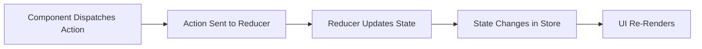

# **🔹 Introduction to Redux in React**

### **What is Redux?**

Redux is a **state management library** for JavaScript applications, commonly used with **React** to manage global state efficiently. It helps store and manage application data in a **centralized store** and makes state predictable across components.

### **Why Use Redux?**

- **Global State Management** → Avoids prop drilling by providing a centralized state store.
- **Predictable State Updates** → Uses a **unidirectional data flow** and strict state update rules.
- **Debugging & Time-Traveling** → Redux DevTools allow for tracking every state change.
- **Better Performance** → Optimizes state updates to prevent unnecessary re-renders.
- **Easier Testing & Scalability** → Decouples UI from state logic, making large applications easier to maintain.

---

## **🔹 How Redux Works in React?**

Redux follows a **unidirectional data flow** with three core concepts:

1️⃣ **Store** → The global object that holds the entire application state.  
2️⃣ **Actions** → Plain JavaScript objects that describe what should change in the state.  
3️⃣ **Reducers** → Pure functions that take the current state and an action, returning a new state.

### **Redux Flow in React**



---

## **🔹 Key Components of Redux**

### **1️⃣ Store (Global State)**

The **store** is where all application state is stored.

- We create a store using `createStore()` (or `configureStore()` in Redux Toolkit).

```js
import { createStore } from "redux";
import rootReducer from "./reducers";

const store = createStore(rootReducer);
export default store;
```

---

### **2️⃣ Actions (Describe What to Do)**

Actions are **plain JavaScript objects** that describe changes in state.

- They have a `type` field (required) and optionally `payload` (data to update).

```js
// actions.js
export const increment = () => ({ type: "INCREMENT" });
export const decrement = () => ({ type: "DECREMENT" });
```

---

### **3️⃣ Reducers (Update the State)**

Reducers **determine how the state should change** based on the action received.

- They take the current `state` and `action`, then return a **new state**.

```js
// reducer.js
const initialState = { count: 0 };

const counterReducer = (state = initialState, action) => {
  switch (action.type) {
    case "INCREMENT":
      return { ...state, count: state.count + 1 };
    case "DECREMENT":
      return { ...state, count: state.count - 1 };
    default:
      return state;
  }
};

export default counterReducer;
```

---

### **4️⃣ Connecting Redux to React**

We use the `Provider` component from `react-redux` to make the store available to the entire React app.

```js
import React from "react";
import ReactDOM from "react-dom";
import { Provider } from "react-redux";
import store from "./store";
import App from "./App";

ReactDOM.render(
  <Provider store={store}>
    <App />
  </Provider>,
  document.getElementById("root")
);
```

---

### **5️⃣ Accessing Redux State in Components**

We use `useSelector` (to read state) and `useDispatch` (to dispatch actions) in functional components.

```js
import React from "react";
import { useSelector, useDispatch } from "react-redux";
import { increment, decrement } from "./actions";

const Counter = () => {
  const count = useSelector((state) => state.count);
  const dispatch = useDispatch();

  return (
    <div>
      <h2>Count: {count}</h2>
      <button onClick={() => dispatch(increment())}>+</button>
      <button onClick={() => dispatch(decrement())}>-</button>
    </div>
  );
};

export default Counter;
```

---

## **🔹 Redux vs. Redux Toolkit (RTK)**

Redux requires a lot of **boilerplate code** (actions, reducers, store).

- **Redux Toolkit (RTK)** simplifies Redux with `createSlice()` and `configureStore()`.
- It is the recommended way to use Redux today.

